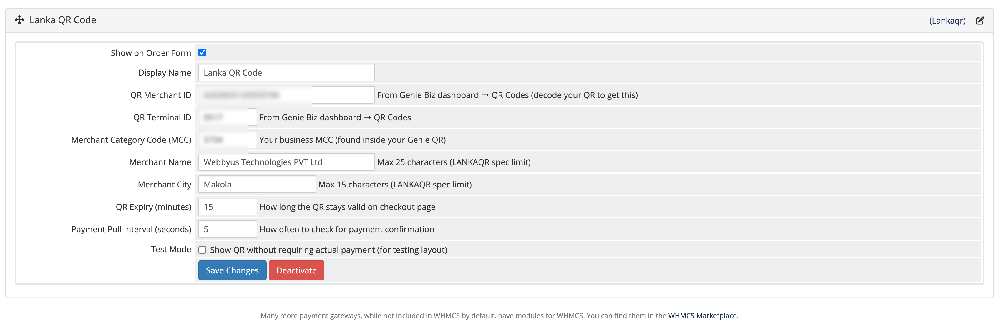

# WHMCS Genie LankaQR Module

<table align="center">
  <tr>
    <td align="center">
      
    </td>
    <td align="center">
      
    </td>
    <td align="center">
      
    </td>
  
  </tr>
</table>

This repository contains the WHMCS payment gateway module for Lankaqr.

## Overview

- Module name: `lankaqr`
- WHMCS integration: gateway module and callback handler
- Location:
  - `modules/gateways/lankaqr.php`
  - `modules/gateways/callback/lankaqr.php`

## Purpose

This module enables WHMCS to process payments through the Lankaqr gateway.

## Installation

1. Copy the `modules/gateways/lankaqr.php` file into your WHMCS installation under `modules/gateways/`.
2. Copy the callback file `modules/gateways/callback/lankaqr.php` into the same path under `modules/gateways/callback/`.
3. In WHMCS admin, go to `Setup` > `Payments` > `Payment Gateways`.
4. Activate and configure the `Lankaqr` gateway using your credentials and settings.

## Usage

- Place the module files in the appropriate WHMCS module directories.
- Configure the gateway in the WHMCS admin panel.
- The callback file handles payment notifications from Lankaqr.

## Notes

- This repository is provided for reference and usage with WHMCS.
- The author retains full authority and ownership.
- The module may be downloaded and used for any party, but modification or redistribution is not permitted without express written permission from the author.

## License

See the `LICENSE` file for license terms and permitted usage.
